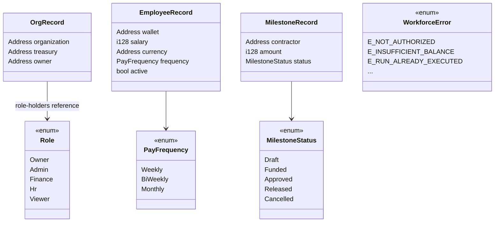
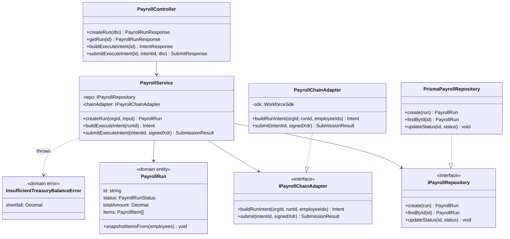
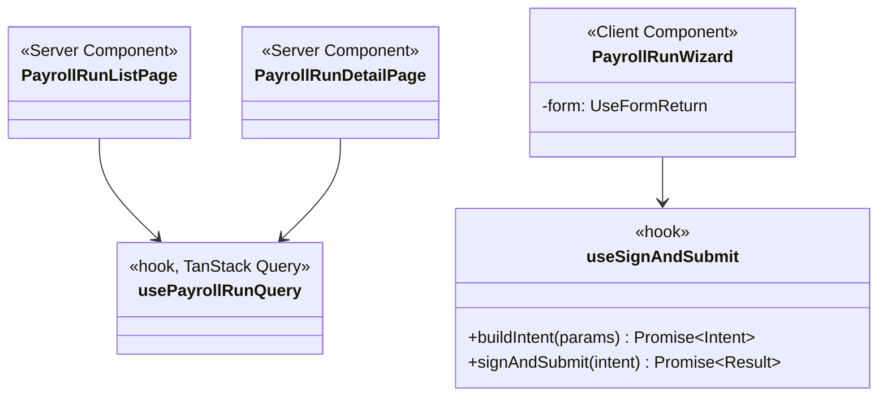

# Class Diagrams

Two views: on-chain contract structs (Rust) and backend domain classes
(TypeScript). Both must stay consistent with
[SMART_CONTRACT_SPECIFICATION.md](./SMART_CONTRACT_SPECIFICATION.md) and
[BACKEND_ARCHITECTURE.md](./BACKEND_ARCHITECTURE.md) respectively.

## 1. Contract data structures

## 2. Backend domain layer (per-module pattern, `payroll` module shown as representative)

This dependency-inversion shape (`Service -> Interface <- Implementation`)
is identical across every backend module (`treasury`, `employees`,
`milestones`, etc.) per
[BACKEND_ARCHITECTURE.md](./BACKEND_ARCHITECTURE.md) §1 — only the entity
names and specific methods change.

## 3. Frontend feature composition (representative, `payroll` feature)

