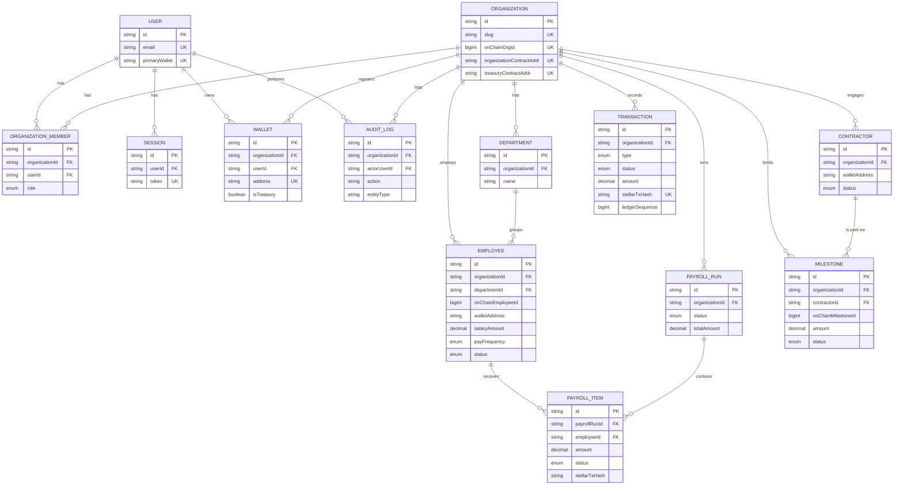

# Entity-Relationship Diagram

Mermaid ER diagram matching [DATABASE_SCHEMA.md](./DATABASE_SCHEMA.md)
exactly. Keep both in sync on any schema change.

## Notes

- `IndexerCursor` is intentionally omitted from this diagram — it has no
  relationship to organizational data; it's infrastructure bookkeeping for
  the Event Indexer, documented in
  [EVENT_INDEXING.md](./EVENT_INDEXING.md).
- Every entity except `User`, `Session`, and `IndexerCursor` carries an
  `organizationId` — this is the tenant-isolation boundary enforced at the
  Prisma query layer (every repository method requires an `organizationId`
  argument; there is no "get all employees" query without an org scope).
