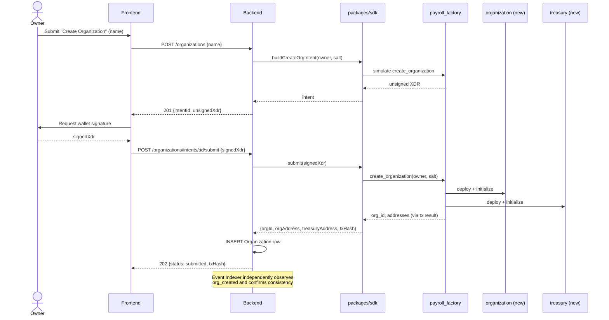
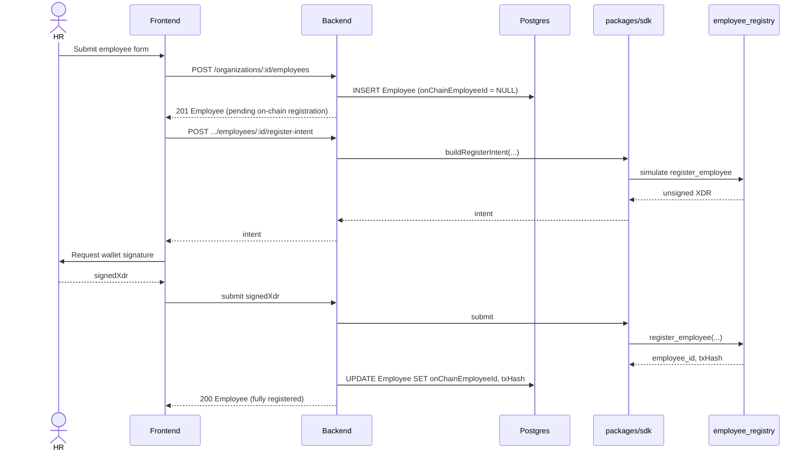
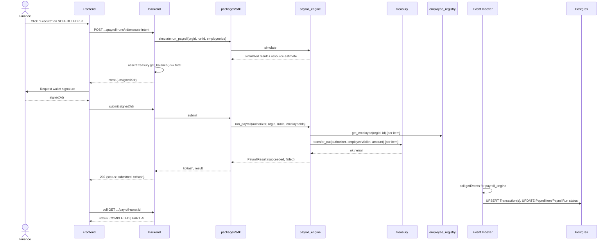
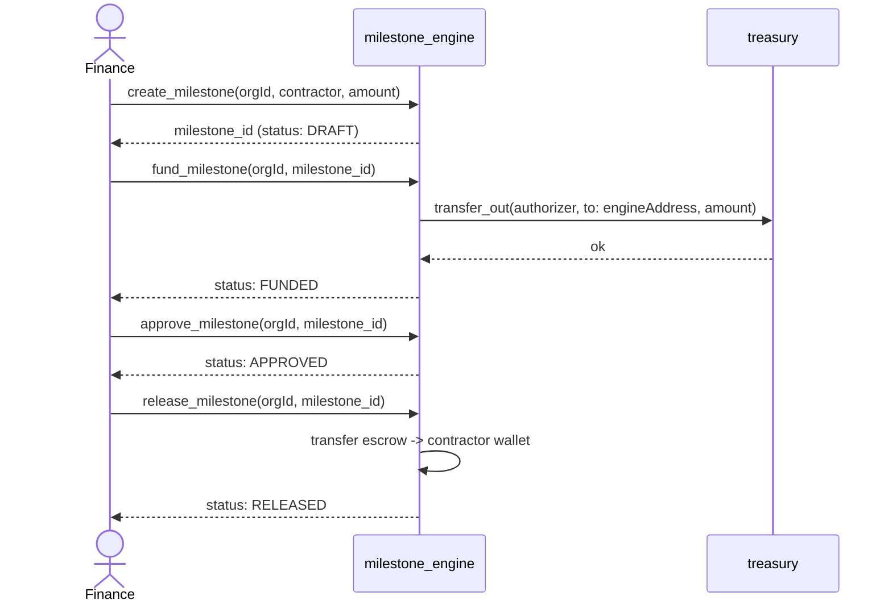
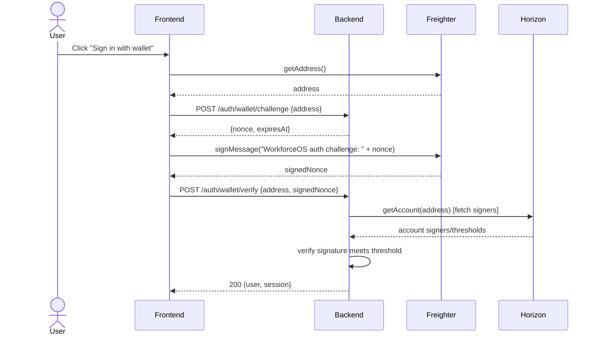

# Sequence Diagrams

Mermaid sequence diagrams for the system's core flows. These are the
authoritative interaction contracts — implementation must match these
message orders, not the other way around.

## 1. Organization creation

## 2. Employee creation (two-phase)

## 3. Payroll execution (single chunk, illustrative)

## 4. Milestone full lifecycle

## 5. Wallet login (challenge/response)

